# CropDoc

**Point your phone at a leaf and get an instant disease diagnosis and
treatment plan, fully offline.**

CropDoc is an Android app for farmers who can't count on a signal in the
field. It spots 38 crop leaf conditions across 14 crops with an on-device
neural network, explains how to treat them, works out how much fungicide to
mix, and answers follow-up questions with a small AI assistant that also
runs on the phone. None of this needs an internet connection.

Built for **NextStep Hacks 2026** (theme: *Earth Forward*, Machine Learning / AI track).

<p align="center">
  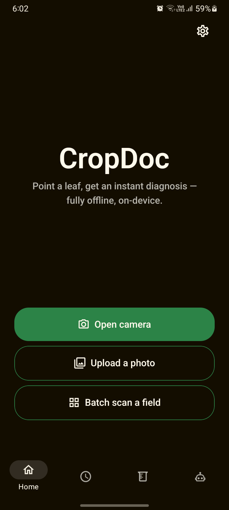
  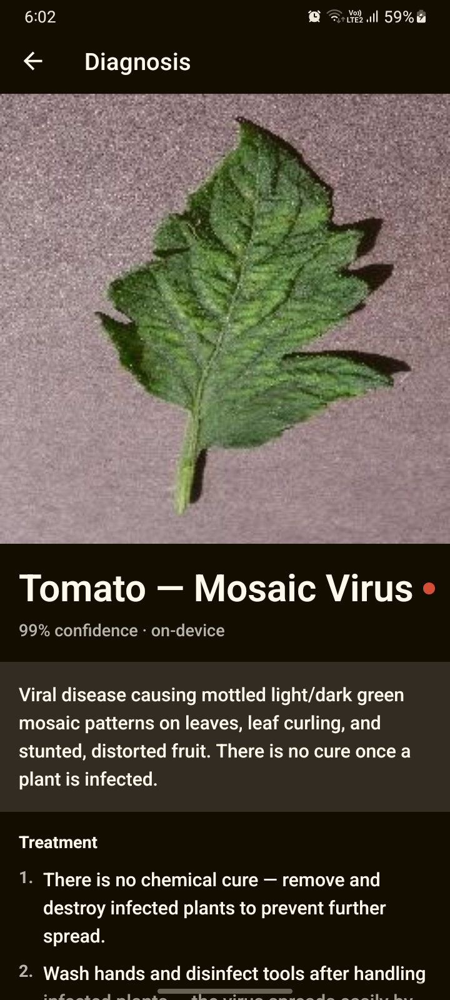
  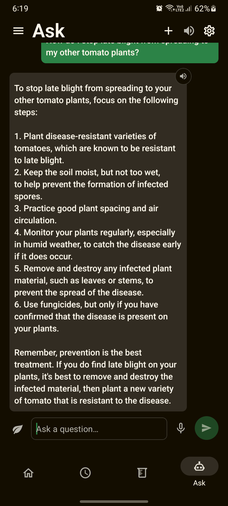
</p>

## Contents

- [Why CropDoc](#why-cropdoc)
- [Features](#features)
- [Screenshots](#screenshots)
  - [Offline vs. Gemini second opinion](#offline-vs-gemini-second-opinion)
- [How it works](#how-it-works)
- [Supported crops](#supported-crops)
- [Tech stack](#tech-stack)
- [Getting started](#getting-started)
- [Project structure](#project-structure)
- [Privacy](#privacy)
- [Known limitations](#known-limitations)
- [Further reading](#further-reading)

## Why CropDoc

Plant disease destroys a large share of the world's crops every year. When a
farmer can't tell one leaf disease from another, the usual response is to
spray broad-spectrum chemicals, which costs money, harms soil and water, and
often doesn't treat the real problem. Most diagnosis apps need a good data
connection, and fields often don't have one.

CropDoc runs everything on the phone. It identifies the specific disease,
recommends a targeted treatment, and calculates a sensible dose, so farmers
spray less and spray the right thing.

## Features

| | |
| --- | --- |
| **Instant offline diagnosis** | Take a photo or pick one from the gallery. A MobileNetV2 model on the phone identifies the disease on the spot and shows a confidence score, a description, and step-by-step treatment. |
| **Batch field scanning** | Walk a field and scan leaf after leaf. At the end you get a summary that flags the worst finding and counts each disease, and the whole batch is saved as one group. |
| **Plot progression tracking** | Tag scans with a plot name, e.g. *North Field - Row 3*. CropDoc lists that plot's scans over time and tells you whether it looks better, worse, or unchanged since the last scan. |
| **Dosage calculator** | Pick a crop and disease, then enter your plot size (m², hectares, or acres) or number of plants. CropDoc tells you how much product and water to mix, based on typical label rates. |
| **Label scanner** | Point the camera at a pesticide label. On-device text recognition reads the printed dose and checks it against the typical rate. |
| **Ask, an offline AI assistant** | A small language model (SmolLM2-360M) that runs on the phone and answers farming questions. Its answers draw on CropDoc's treatment data, you can attach any past scan to a question, and chats are saved so you can pick them up later. |
| **Voice in, voice out** | Ask your question out loud (on-device Whisper speech-to-text) and hear the answer read back, for farmers who find reading on a small screen hard. |
| **11 languages** | English, Hindi, Spanish, Mandarin, Portuguese, Bengali, Indonesian, Swahili, Vietnamese, French, and Urdu (right-to-left). Both the interface and the disease/treatment content are translated. |
| **Optional Gemini second opinion** | When you're online, you can add your own free Gemini API key for a more detailed explanation of a diagnosis. The app never depends on it. |

## Screenshots

### Diagnosis

<p>
  
  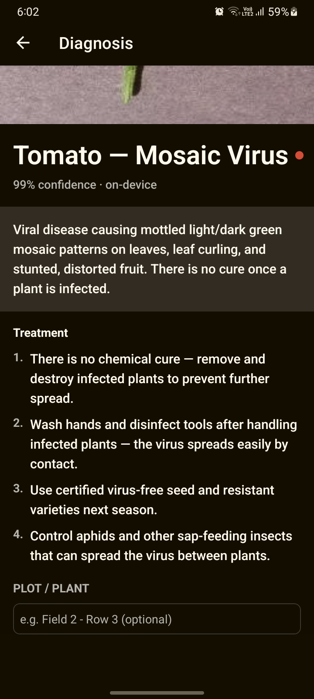
  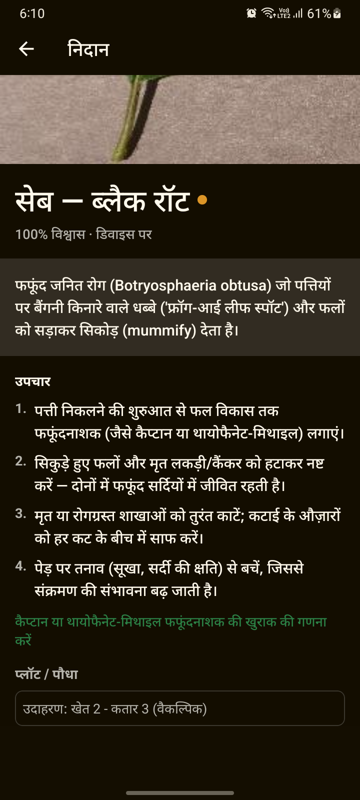
</p>

A diagnosis with its confidence score, then the treatment steps and plot tag
field, and then the same kind of result in Hindi.

### Offline vs. Gemini second opinion

The same Tomato Mosaic Virus scan, with and without the optional online
second opinion:

<table>
  <tr>
    <th>Offline only (always available)</th>
    <th>With Gemini second opinion (online, optional)</th>
  </tr>
  <tr>
    <td></td>
    <td>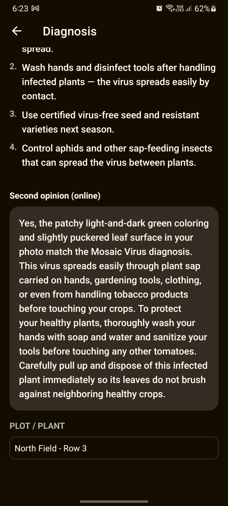</td>
  </tr>
  <tr>
    <td>The on-device model gives the diagnosis and the standard treatment steps, with no connection needed.</td>
    <td>Gemini looks at the photo, confirms whether it matches the diagnosis, explains how the disease spreads, and adds tips specific to that photo.</td>
  </tr>
</table>

### History and plot tracking

<p>
  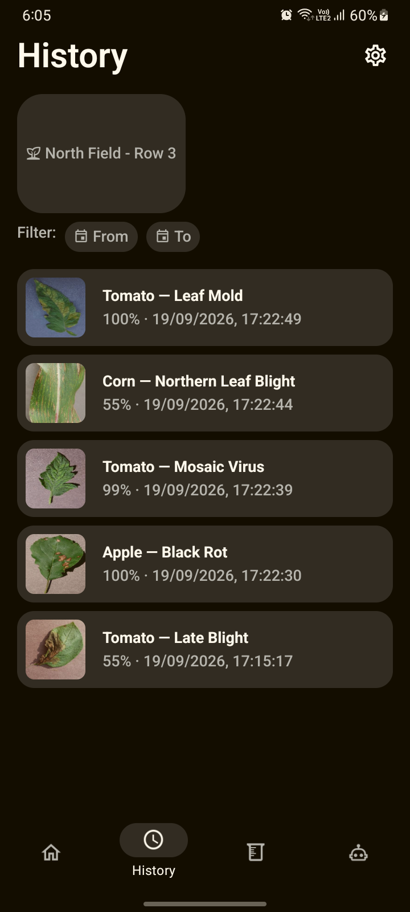
  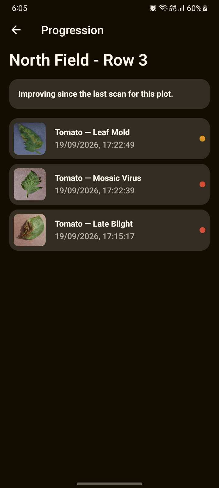
</p>

Every scan is saved on the phone. You can filter by date and open any plot
to see how it's changing over time.

### Dosage calculator

<p>
  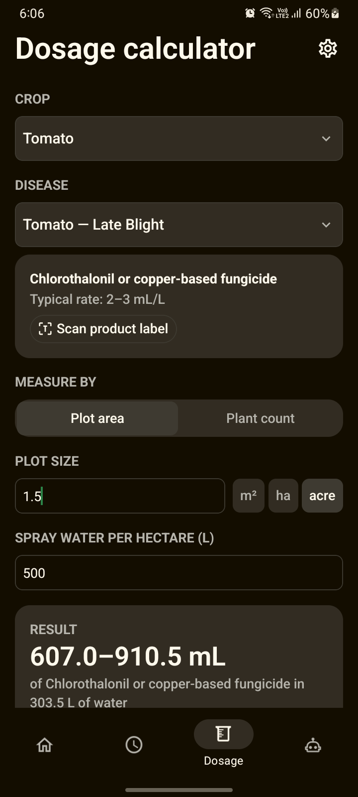
  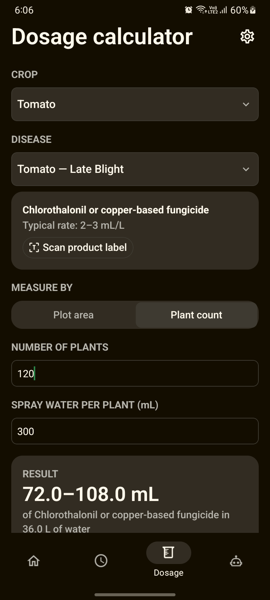
</p>

Doses for a 1.5-acre plot and for 120 plants, for tomato late blight.

### Ask (offline AI assistant)

<p>
  
  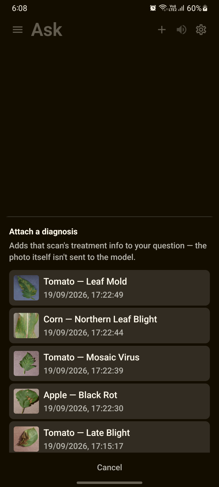
  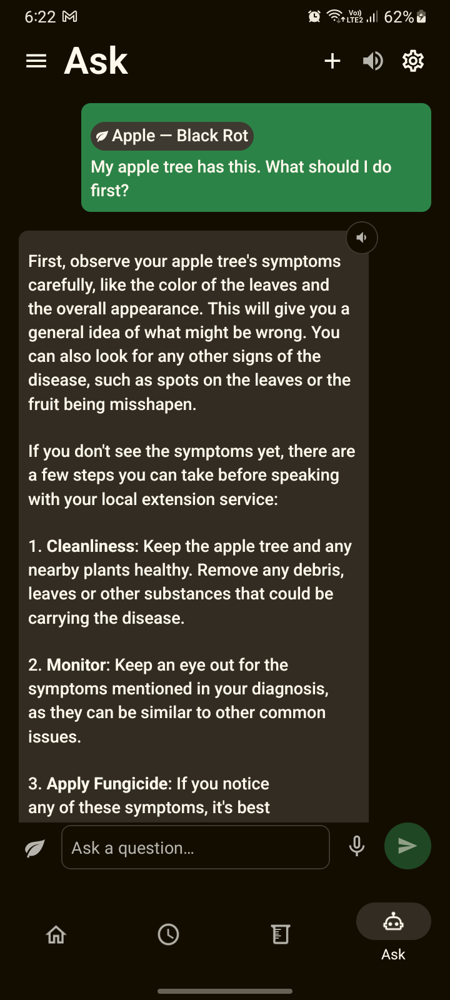
  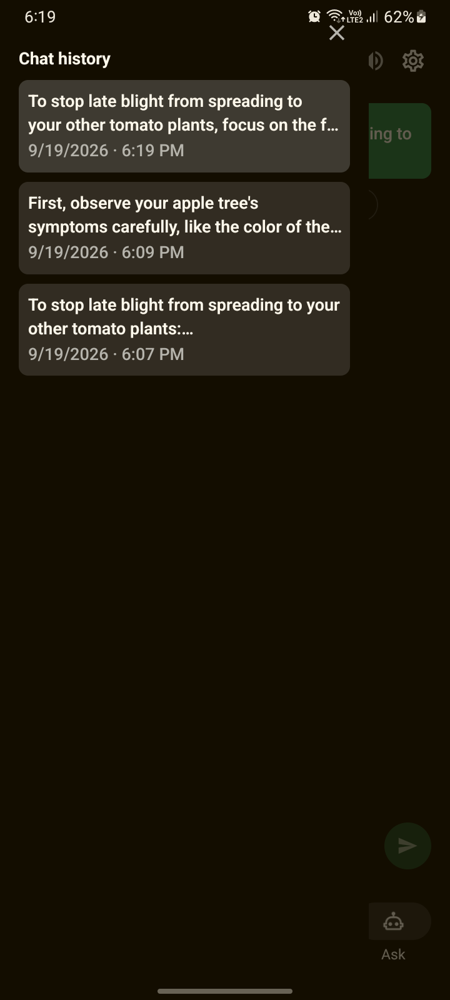
</p>

Ask a question, attach a past scan so the answer is about that diagnosis,
and come back to earlier conversations. It all runs on the phone.

### Settings and languages

<p>
  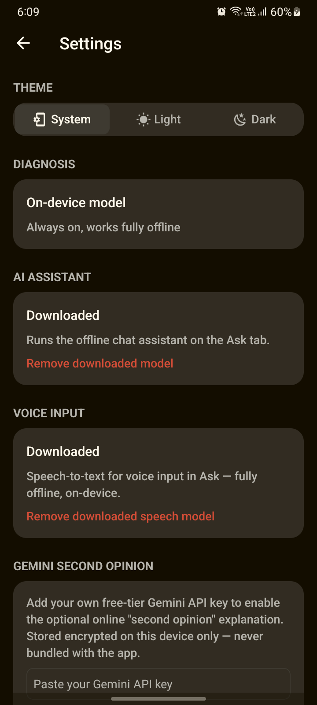
  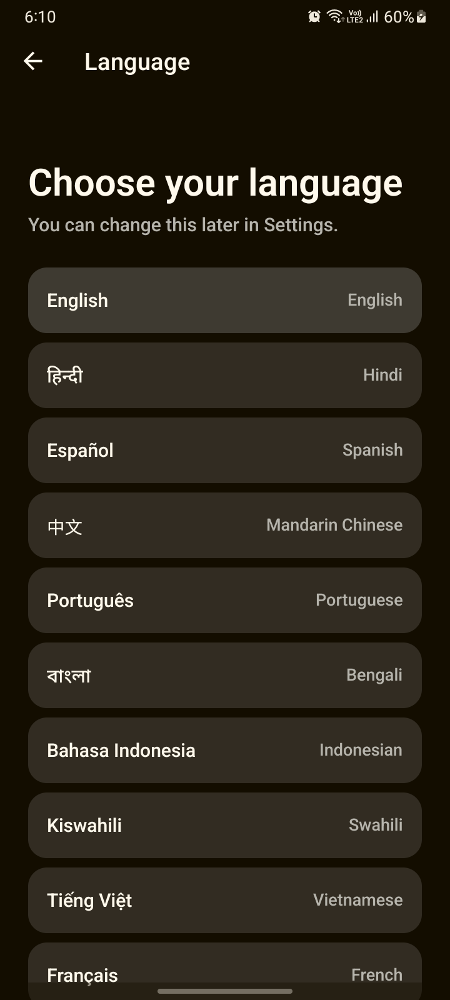
</p>

## How it works

```
 Camera / gallery photo
          │
          ▼
 Center-crop, resize to 224×224, normalize
          │
          ▼
 MobileNetV2 (TensorFlow Lite, on-device)  ──►  38 disease scores
          │
          ▼
 Top match + bundled treatment data (in your language)
          │
          ▼
 Result screen  ──►  saved to local SQLite history
          │
          ├──►  Dosage calculator (typical label rates, ML Kit label OCR)
          ├──►  Ask assistant (SmolLM2 via llama.rn, grounded in treatment data)
          └──►  Optional: Gemini second opinion (only if online and a key is set)
```

- **Classifier:** a MobileNetV2 fine-tuned on the PlantVillage dataset
  (about 95% evaluation accuracy), converted from PyTorch to TensorFlow Lite
  and bundled inside the app.
- **Assistant:** SmolLM2-360M-Instruct runs through `llama.rn`. When you ask
  a question, the app finds the most relevant treatment entries with vector
  search, using embeddings from the same model, and includes them in the
  prompt so the answer is grounded in real treatment data.
- **Speech:** Whisper (tiny) runs on the phone through `whisper.rn` for voice
  input, and the phone's built-in text-to-speech reads answers aloud.

The two AI models used by Ask (~370 MB chat model and ~78 MB speech model)
are **optional one-time downloads**, which keeps the app itself small. The
diagnosis model is always included.

## Supported crops

Apple, Blueberry, Cherry, Corn (maize), Grape, Orange, Peach, Bell pepper,
Potato, Raspberry, Soybean, Squash, Strawberry, and Tomato. That's 38
classes in total: common diseases such as scab, rusts, blights, mildews,
leaf spots, and mosaic and leaf-curl viruses, plus healthy leaves for most
crops.

## Tech stack

| Area | Technology |
| --- | --- |
| App | Expo SDK 57, React Native 0.86, TypeScript, Expo Router |
| Diagnosis model | MobileNetV2 → TensorFlow Lite via `react-native-fast-tflite` |
| Chat assistant | SmolLM2-360M-Instruct (GGUF) via `llama.rn` |
| Speech-to-text | Whisper tiny via `whisper.rn` |
| Text-to-speech | `expo-speech` |
| Label OCR | Google ML Kit text recognition (bundled, offline) |
| Storage | `expo-sqlite` (history, chats, embeddings), `expo-secure-store` (API key) |
| Translations | `i18next` / `react-i18next` |
| CI/CD | GitHub Actions + EAS Build / EAS Update |

## Getting started

CropDoc is **Android only**. It uses native modules (TFLite, llama.cpp,
whisper.cpp), so it **will not run in Expo Go**. You need a development
build.

### Prerequisites

- Node.js (current LTS) and npm
- Android Studio with the Android SDK and NDK, or an [EAS](https://expo.dev/eas) account
- An Android phone with an arm64 CPU (virtually all modern phones)

### Install and run

```sh
npm install

# Option A: build and install locally on a USB-connected phone
npm run android:lite       # resource-capped wrapper around `expo run:android`

# Option B: build in the cloud with EAS
npx eas build --profile development --platform android

# Then start the dev server and open the app on your phone
npm run start
```

The first native build is slow because `whisper.rn` compiles whisper.cpp from
source. After that, JavaScript changes reload instantly through Metro.

### Try it out

1. Tap **Open camera** or **Upload a photo** and choose a leaf image.
2. Read the diagnosis and treatment, and optionally tag it with a plot name.
3. Open the **Dosage** tab to work out how much to spray.
4. Open the **Ask** tab, download the assistant once, and ask a question.

## Project structure

```
src/
├── app/                  Screens (Expo Router, file-based routing)
│   ├── (tabs)/           Home, History, Dosage, Ask
│   ├── result.tsx        Diagnosis result
│   ├── camera*.tsx       Single and batch camera
│   ├── plot/[tag].tsx    Plot progression
│   └── settings.tsx
├── components/           Shared UI
└── lib/
    ├── model/            Preprocessing, TFLite inference, labels, treatments
    ├── llm/              Chat model download, engine, embeddings, retrieval
    ├── stt/              Whisper speech-to-text and WAV recorder
    ├── dosage/           Dose maths and label OCR parsing
    ├── i18n/             Translations for 11 languages
    ├── db.ts             SQLite storage
    └── gemini.ts         Optional online second opinion
assets/model/             model.tflite and per-language treatment data
plugins/                  Expo config plugins (Android build tuning)
docs/                     Screenshots and technical notes
```

## Privacy

- Photos, scan history, and chats are stored **only on your phone**.
- Diagnosis, the assistant, speech recognition, and label reading all run
  **on the device**.
- The only network requests are the optional model downloads and the
  optional Gemini second opinion. For the Gemini feature you supply your own
  API key, which is stored encrypted in the Android Keystore and never
  shipped with the app.

## Known limitations

- The classifier was trained on PlantVillage images, which are mostly
  single leaves on plain backgrounds. Photos of busy real-world scenes can
  lower its accuracy. For best results, photograph one leaf that fills the
  frame.
- Dosage figures are **typical label rates**, not instructions for a
  specific product. Always follow the label on the product you're using.
- The assistant is a small 360M-parameter model. It's useful for general
  guidance but can make mistakes, so check important decisions with a local
  agricultural extension officer.
- The non-English translations were machine-generated and have been checked
  for structure, but not yet reviewed by native speakers.

## Further reading

- [docs/TECHNICAL.md](docs/TECHNICAL.md): implementation details for the
  assistant's retrieval, label OCR, CI/OTA setup, translations, and native
  build notes.
